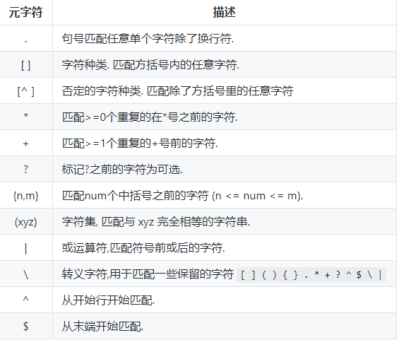

#正则表达式

##元字符

### 点运算符 `.`
`.`是元字符中最简单的例子.
`.`匹配任意单个字符, 但不匹配换行符.
例如, 表达式`.ar`匹配一个任意字符后面跟着是`a`和`r`的字符串.

<pre>
".ar" => The <a href="#learn-regex"><strong>car</strong></a> <a href="#learn-regex"><strong>par</strong></a>ked in the <a href="#learn-regex"><strong>gar</strong></a>age.
</pre>

[在线练习](https://regex101.com/r/xc9GkU/1)

### `*` 号
`*`号匹配 在`*`之前的字符出现`大于等于0`次.
例如, 表达式 `a*` 匹配以0或更多个a开头的字符, 因为有0个这个条件, 其实也就匹配了所有的字符. 表达式`[a-z]*` 匹配一个行中所有以小写字母开头的字符串.

<pre>
"[a-z]*" => T<a href="#learn-regex"><strong>he</strong></a> <a href="#learn-regex"><strong>car</strong></a> <a href="#learn-regex"><strong>parked</strong></a> <a href="#learn-regex"><strong>in</strong></a> <a href="#learn-regex"><strong>the</strong></a> <a href="#learn-regex"><strong>garage</strong></a> #21.
</pre>

[在线练习](https://regex101.com/r/7m8me5/1)

`*`字符和`.`字符搭配可以匹配所有的字符`.*`.
`*`和表示匹配空格的符号`\s`连起来用, 如表达式`\s*cat\s*`匹配0或更多个空格开头和0或更多个空格结尾的cat字符串.

<pre>
"\s*cat\s*" => The fat<a href="#learn-regex"><strong> cat </strong></a>sat on the <a href="#learn-regex">con<strong>cat</strong>enation</a>.
</pre>

[在线练习](https://regex101.com/r/gGrwuz/1)

###  `+` 号
`+`号匹配`+`号之前的字符出现 >=1 次个字符.
例如表达式`c.+t` 匹配以首字母`c`开头以`t`结尾,中间跟着任意个字符的字符串.

<pre>
"c.+t" => The fat <a href="#learn-regex"><strong>cat sat on the mat</strong></a>.
</pre>

[在线练习](https://regex101.com/r/Dzf9Aa/1)

###  `?` 号
在正则表达式中元字符 `?` 标记在符号前面的字符为可选, 即出现 0 或 1 次.
例如, 表达式 `[T]?he` 匹配字符串 `he` 和 `The`.

<pre>
"[T]he" => <a href="#learn-regex"><strong>The</strong></a> car is parked in the garage.
</pre>

[在线练习](https://regex101.com/r/cIg9zm/1)

<pre>
"[T]?he" => <a href="#learn-regex"><strong>The</strong></a> car is parked in t<a href="#learn-regex"><strong>he</strong></a> garage.
</pre>

[在线练习](https://regex101.com/r/kPpO2x/1)

### 简写字符集
正则表达式提供一些常用的字符集简写. 如下:

|简写|描述|
|:----:|----|
|.|除换行符外的所有字符|
|\w|匹配所有字母数字, 等同于 `[a-zA-Z0-9_]`|
|\W|匹配所有非字母数字, 即符号, 等同于: `[^\w]`|
|\d|匹配数字: `[0-9]`|
|\D|匹配非数字: `[^\d]`|
|\s|匹配所有空格字符, 等同于: `[\t\n\f\r\p{Z}]`|
|\S|匹配所有非空格字符: `[^\s]`|
|\f|匹配一个换页符|
|\n|匹配一个换行符|
|\r|匹配一个回车符|
|\t|匹配一个制表符|
|\v|匹配一个垂直制表符|
|\p|匹配 CR/LF (等同于 `\r\n`)，用来匹配 DOS 行终止符|
